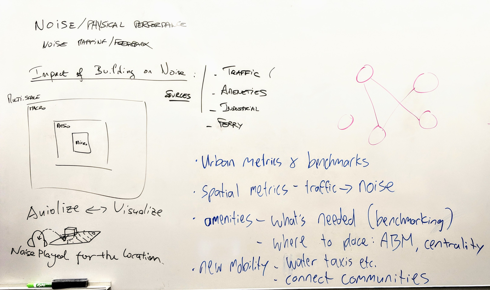
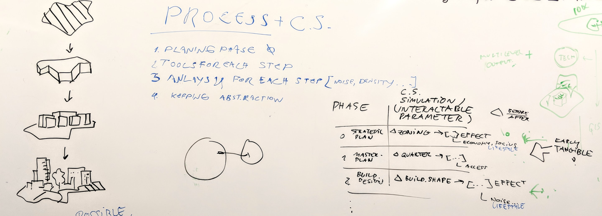

## Summary for the DIPAS workshop, Sept. 4. '18

##### DIPAS workshop 4th September - Processes and CityScope

- the current tool offers a touch table system with multilayer data observatory
- using AI and machine learning NLP for understanding the public sense
- Mobile client not really works
- The X zoning is used to communicate the implications of the city planning projects
- Future project:
  - Grassbrook project

## Discussion during session

- the need for interpretation in site
- LOD2/ LOD3 for 3d models of the proposed plan
- Clear EU standards for noise and other env. effects modeling
- Add dynamic phases into the design process;

  1. pre design programming
  2. initial volumetric design
  3. Architecture and urban design phase

- Suggesting projection on dynamic urban impacts of the design

## Tools group

#### Data and Simulations

- Urban metrics & benchmarks
- Spatial metrics – traffic  noise is an important topic
- Amenities
  o What’s needed? (Benchmarking)
  o Where to place it? (ABM, centrality)
- New mobility
  o Water taxis etc.
  o Connecting communities
  Summary: Benchmarking and predicting Urban Experiences

## Process group

- incorporate CS in different phases of the project
- generative scenario creation
- ease of use and communication ['new language']
  

- Process seems to be planned out already very well
- Luis: Are the problems rather technical?
- Analysis for each step (noise, density, …)
- Keeping a certain abstraction level is important
- A new “Language” needs to be invented in order to make everyone understand
- Jörg: In each step of the process specific CityScope simulations are needed
- What kinds of simulations are possible in what phase?
- Phase CityScope Simulation (Interactable Parameter)
  - Strategic Plan Zoning  […] Effect: economic, social, …
  - Masterplan Quarter  […] Effect: access, …
  - Build decision Build shape […] Effect: Noise, …
- In each simulation certain parameters will be changed to observe the effects
- Early tangible experience is important! In the earliest stage possible
